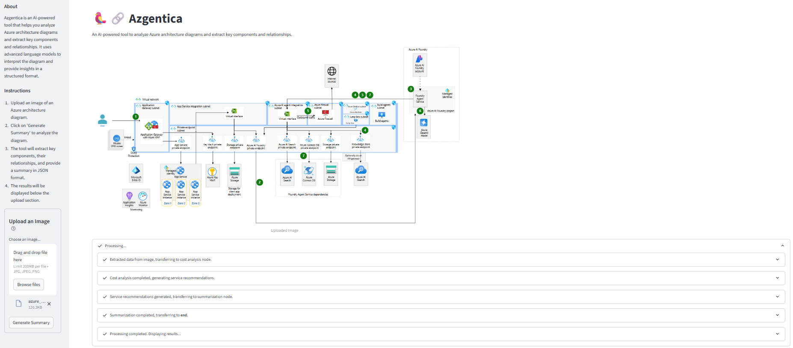

# 🔷 Azgentica

**Azgentica** is a vision-powered intelligent agent that decodes Azure architecture diagrams into structured, actionable insights.

Whether you're trying to **understand**, **validate**, or **optimize** your cloud design, Azgentica helps you move from static architecture drawings to dynamic, AI-assisted workflows — in seconds.

> ⚡ Turn visual chaos into cloud clarity.
> 🔍 Visualize · Decode · Optimize.

**Tool Images**




---

## 🚀 What Can Azgentica Do?


### 🧠 Intelligent Diagram Understanding

Uses cutting-edge visual-language models to *automatically extract* Azure services, components, and their relationships from architecture diagrams (PNG/JPG). No manual tagging needed.

### 🤖 Azure Service Recommendations

Analyzes extracted components and suggests relevant Azure services based on Microsoft’s **Well-Architected Framework**, deployment patterns, and inferred intent.


### 🌐 Semantic Graph Extraction

Builds a graph-based JSON structure of the architecture — with precise **nodes (services)** and **edges (connections)** — ready for downstream analysis and visualization.

### 💸 Cost & Optimization Insights

Evaluates estimated costs and highlights **optimization opportunities** to help reduce waste and align with architectural best practices — early in the design lifecycle.

---

## 📦 Quick Start

### 🔧 Installation

```bash
git clone https://github.com/sriksmachi/azgentica
cd azgentica
pip install -r requirements.txt
```


### 🚮 Data Pipeline

Azgentica provides service recommendations using data extracted from Azure Service guides [here](https://learn.microsoft.com/en-us/azure/well-architected/service-guides/?product=popular). The data is extracted using Azure Document intelligence and made available under `data/azure-service-recommendations.csv`, `data/azure-well-architected.pdf`. 

**Note**: This step is optional unless you want to generate the recommendations again. 

```bash 
python datapipeline.py
```

---

## 🖼️ How It Works

### Step 1: Upload a Diagram

Use the built-in Streamlit app or CLI tool:

```bash
streamlit run streamlit_app.py
```

Or from command line:

The following generates summary in markdown format, a sample is available [here](sample_images/azure_architecture_basic_summmary.md)

```bash
python workflow.py -i path/to/diagram.png -o path/to/summary.md
```


### Step 3: Transform & Analyze

```bash
python datapipeline.py --input extracted.json --output processed.json
```

Transforms raw data into enriched, validated output with cost and service recommendations.

---

## 📈 Visualize with NetworkX

For running sample see `workbench.ipynb`

```python
import networkx as nx
import matplotlib.pyplot as plt
from azgentica import load_architecture_json

nodes = [
  # Copy from Output
   {"id": "Azure Active Directory", "type": "azure", "label": "Azure Active Directory"}
   ....
]

edges = [
  # Copu from output
  {"source": "Internet", "target": "Azure Active Directory", "label": "Authentication"},
}

G = nx.DiGraph()
G.add_nodes_from((node["id"], {"type": node["type"], "label": node["label"]}) for node in nodes)
G.add_edges_from((edge["source"], edge["target"], {"label": edge["label"]}) for edge in edges)
# Draw the architecture graph
nx.draw(G, with_labels=True)
plt.show()
```

---

## 🧩 Key Use Cases

* ✅ Auto-generate system architecture graphs
* 🔄 Keep architecture documentation continuously updated
* 🔍 Validate network flow, segmentation, and security posture
* ⚙️ Feed structured architecture into GenAI/ML pipelines for:

  * Infra as Code generation
  * Cost optimization
  * Resource right-sizing
  * Compliance scoring

---

## 🛠️ Roadmap

### Core Enhancements

* [ ] ARM/Bicep/IaC generation from extracted graph
* [ ] AI Copilot Chat: Chat with AI to get actional suggestions and code
* [ ] Smart service mapping: Currently the services are identified using key word search which does not match 100%
* [ ] Provide web lookup for latest cost, currently it uses knowledge cut-off of LLM.

### Deployment Options

* [ ] Docker support for easy self-hosting
* [ ] Azure-native version for cloud-based integration

---

## 🤝 Contributing

We’re just getting started — and we welcome your contributions!

You can:

* 🐛 Submit bug reports or feature requests (via Issues)
* 🚀 Contribute via pull requests
* 💬 Discuss ideas in GitHub Discussions

---

## 📄 License

This project is licensed under the **MIT License** — open, transparent, and free to build upon.

---

## 👨‍💻 Built For

Cloud architects, platform engineers, DevOps teams, and AI developers looking to:

* Shorten architecture review cycles
* Detect design flaws early
* Enable automated validation pipelines
* Bridge visual planning with infrastructure automation

---

## 🌟 Inspiration

**Azgentica** merges the power of **vision AI**, **graph theory**, and **Azure expertise** to streamline how cloud systems are visualized and evolved.

---

> **Have a diagram?**
> **Let Azgentica turn it into insight.**

---

